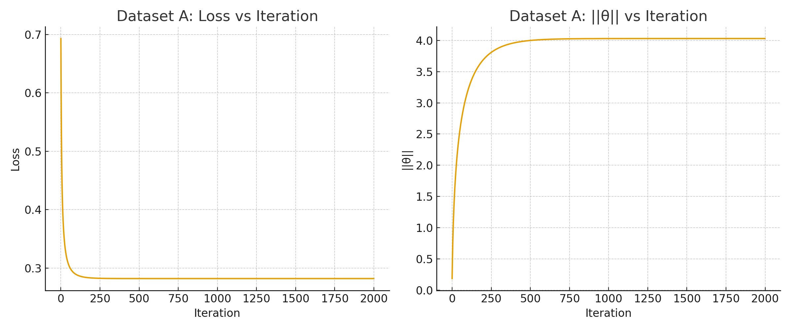
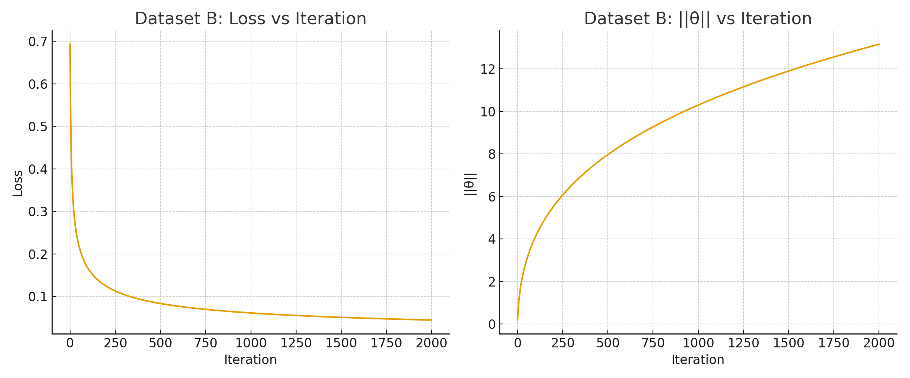

# CS229 Problem Set 2

**Author:** Vedant  
**Course:** CS229 - Machine Learning  
**Date:** August 2025

##  Table of Contents
- [Problem Overview](#problem-overview)
- [Solution](#solution)
  - [Part (a): Behavior on Different Datasets](#part-a-behavior-on-different-datasets)
  - [Part (b): Mathematical Analysis](#part-b-mathematical-analysis)
  - [Part (c): Effect of Various Modifications](#part-c-effect-of-various-modifications)
  - [Part (d): Comparison with SVMs](#part-d-comparison-with-svms)
- [Results](#results)

##  Problem Overview

This problem set explores the behavior of logistic regression on linearly separable vs. non-linearly separable datasets, investigating why the algorithm exhibits different convergence properties and examining potential solutions to parameter divergence issues.

##  Solution

### Part (a): Behavior on Different Datasets

**Dataset A (Not Linearly Separable):**
- Logistic regression converges to a finite parameter vector θ*
- Gradient descent reaches a stable solution with bounded parameters

**Dataset B (Linearly Separable):**
- The likelihood can be increased arbitrarily by scaling θ
- No finite maximizer exists for unregularized logistic loss
- In practice, ||θ|| grows without bound

### Part (b): Mathematical Analysis

#### Model Definition
The logistic regression model is defined as:

```
P(y_i | x_i; θ) = σ(y_i θᵀ x_i)
```

where the sigmoid function is:

```
σ(z) = 1/(1 + e^(-z))
```

#### Loss Function
The negative log-likelihood (loss function) is:

```
J(θ) = (1/m) Σᵢ₌₁ᵐ log(1 + e^(-y_i θᵀ x_i))
```

#### Mathematical Proof of Divergence

For linearly separable data, there exists a vector θ₀ such that:
- y_i θ₀ᵀ x_i > 0 for all i

For any scalar t > 0:

```
J(tθ₀) = (1/m) Σᵢ₌₁ᵐ log(1 + e^(-t y_i θ₀ᵀ x_i))
```

**Key insight:** As t → ∞:
- Each term in the sum approaches 0
- J(tθ₀) → 0 
- ||tθ₀|| → ∞

This proves that the loss can be driven arbitrarily close to zero only by letting ||θ|| → ∞, meaning no finite minimizer exists.

#### Empirical Evidence

- **Dataset B:** Training loss decreases steadily toward zero while ||θ|| grows without bound
- **Dataset A:** J(θ) attains a finite minimum and gradient descent converges to finite θ*

### Part (c): Effect of Various Modifications

| Modification | Effect | Explanation |
|--------------|--------|-------------|
| **(i) Different constant learning rate** |  **Does not fix** | Only affects optimization dynamics, not the fundamental issue of no finite minimizer |
| **(ii) Decreasing learning rate (α_t ∝ 1/t²)** |  **Does not fix** | May slow parameter divergence but optimum is still at infinity |
| **(iii) Linear scaling of input features** |  **No effect** | Preserves separability, so divergence issue remains |
| **(iv) L₂ regularization (λ\\|θ\\|²)** |  **Fixes the problem** | Creates strictly convex objective with finite minimizer |
| **(v) Adding Gaussian noise** |  **May work** | Can destroy exact separability but is heuristic approach |

#### Detailed Analysis of L₂ Regularization

The regularized objective becomes:

```
J_reg(θ) = (1/m) Σᵢ₌₁ᵐ log(1 + e^(-y_i θᵀ x_i)) + λ||θ||²
```

**Why this works:**
- The regularization term λ||θ||² penalizes large parameter values
- The objective becomes strictly convex
- Guarantees a unique finite minimizer
- Balances fit to data with parameter complexity

### Part (d): Comparison with SVMs

**Support Vector Machines are NOT vulnerable to this divergence issue.**

#### SVM Objective Function

```
min_{w,b,ξ} (1/2)||w||² + C Σᵢ ξᵢ
```

Subject to:
```
y^(i)(wᵀx^(i) + b) ≥ 1 - ξᵢ
ξᵢ ≥ 0
```

#### Why SVMs Don't Diverge

1. **Built-in regularization:** The (1/2)||w||² term is explicitly included
2. **Margin maximization:** Even on linearly separable data, SVMs choose the finite w that maximizes the margin
3. **Structural risk minimization:** The objective balances empirical risk with model complexity

##  Results

### Dataset A (Non-Linearly Separable)

*Logistic regression converges to a finite θ. Loss stabilizes, and ||θ|| remains bounded.*

### Dataset B (Linearly Separable)

*Logistic regression on linearly separable data. Loss decreases toward 0 while ||θ|| grows without bound.*

## 🔍 Key Insights

1. **Fundamental Issue:** Unregularized logistic regression on linearly separable data leads to parameter divergence
2. **Root Cause:** Perfect separation allows infinite scaling of parameters to drive loss to zero
3. **Practical Solution:** L₂ regularization is the most principled fix
4. **Algorithm Choice:** SVMs naturally avoid this issue through built-in regularization
5. **Real-world Implication:** Always use regularization when working with potentially separable data

## 📖 References

- CS229 Course Materials, Stanford University
- Andrew Ng's Machine Learning Course
